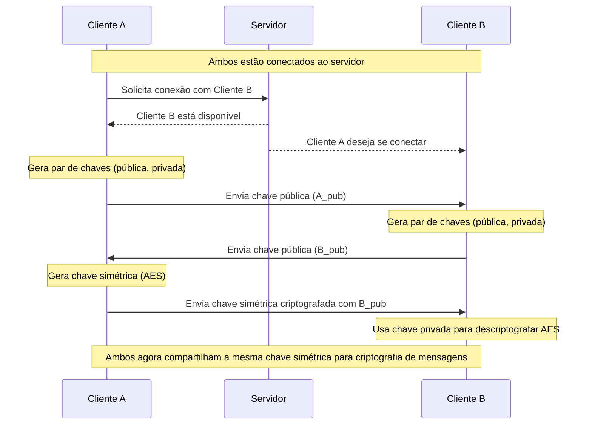
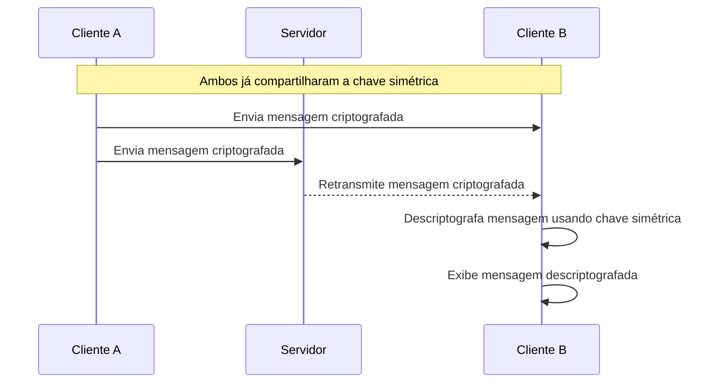
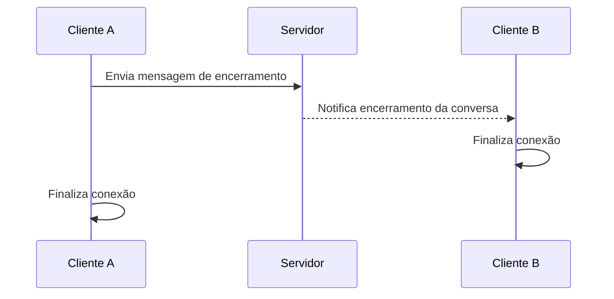
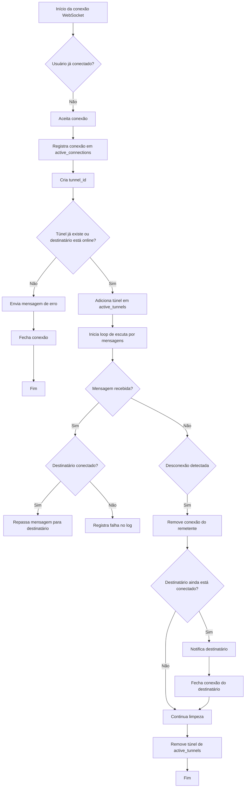

# Comunicação Cliente-Servidor

Esse documento descreve o fluxo de comunicação
entre os aplicativos clientes da aplicação e o servidor.
O objetivo principal é ter um documento central que todas
as pessoas envolvidas no projeto possam ler e compreender
todo o fluxo que ocorre durante o processo de
comunicação entre dois usuários utilizando o sistema.

> [!TIP]
> Futuramente essa documentação poderá ser otimizada
> e até mesmo ser renderizada como site utilizando o
> [MkDocs](https://www.mkdocs.org/) com o tema
> [Material](https://squidfunk.github.io/mkdocs-material/).

## Conceitos iniciais

Para entender a lógica da aplicação, principalmente do
servidor, é necessário antes entendermos alguns conceitos
e tecnologias utilizadas durante o desenvolvimento, tais
conceitos são listados abaixo.

### Protocolo WebSocket

O protocolo WebSocket permite comunicação bidirecional
full-duplex contínua entre servidores web e clientes web
por meio de uma conexão TCP subjacente.

Em resumo, o protocolo básico do WebSocket consiste em um
handshake de abertura (atualizando a conexão de HTTP para
WebSockets), seguido pela transferência de dados.
Após o cliente e o servidor negociarem com sucesso o
handshake de abertura, a conexão WebSocket atua como um
canal de comunicação full-duplex persistente, onde cada
lado pode, independentemente, enviar dados à vontade.
Clientes e servidores transferem dados de um lado para o
outro em unidades conceituais chamadas mensagens, que,
podem consistir em um ou mais quadros. Uma vez que a
conexão WebSocket tenha cumprido seu propósito, ela pode
ser encerrada por meio de um handshake de fechamento.

#### Ok, mas porque usarmos WebSockets?

A abordagem utilizando WebSockets permite que o servidor
atue como um servidor de sinalização e retransmissão,
mantendo sessões ativas entre os pares e garantindo a
entrega das mensagens de forma eficiente.

> [!TIP]
> Além disso, essa arquitetura é especialmente importante
> para contornar restrições comuns em redes residenciais
> e móveis, como as impostas por NATs simétricos e CGNATs
> (Carrier-Grade NAT), que frequentemente impedem a
> criação de conexões diretas entre dispositivos,
> já que estes não possuem um endereço IP público
> acessível. Ao centralizar a comunicação no servidor,
> é possível intermediar as trocas de mensagens mesmo em
> cenários onde não há visibilidade direta entre os
> clientes, assegurando que a comunicação permaneça fluida,
> segura e contínua.

Dessa forma, o WebSocket se mostra a solução ideal para
sustentar a troca de mensagens criptografadas em tempo
real entre usuários conectados por meio de redes com
infraestruturas diversas.

Para entender mais sobre o protocolo WebSocket,
veja os seguintes links:

- [WebSockets - Código Fonte TV](https://www.youtube.com/watch?v=dQw4w9WgXcQ)
- [https://websocket.org/guides/websocket-protocol/](https://websocket.org/guides/websocket-protocol/)
- [WebSocket - Wikipedia](https://en.wikipedia.org/wiki/WebSocket)

## O fluxo da aplicação

O fluxo de comunicação da aplicação entre os usuários e o
servidor envolve diversas etapas, dentre elas o
estabelecimento de um canal de comunicação seguro
por meio de criptografia simétrica, e depois o trânsito
de mensagens entre os dois usuários interligados pelo servidor.

Abaixo vamos descrever detalhadamente como ocorre cada
processo do sistema.

### 1. Conexão do usuário com o servidor

Quando um usuário se conecta com o servidor ele precisa
fornecer duas informações necessárias para a conexão:

- `nome de usuário` - Um nome de usuário que será seu
identificador no servidor.
- `endereço do servidor` - Endereço do servidor para
conexão, por exemplo: `https://200.15.23.8:8000`.

> [!IMPORTANT]
> Caso já exista um usuário conectado ao servidor com
> o `nome de usuário` fornecido o servidor irá recusar
> a conexão.

Posteriormente o usuário deve fornecer o `nome de usuário`
da pessoa com a qual ele deve se comunicar.

Com essas informações o aplicativo cliente realiza
uma requisição websocket ao endpoint `/ws/<nome-de-usuario>@<usuario-de-destino>`
do servidor que trata da comunicação entre os usuários, onde os atributos `nome-de-usuario`
e `usuario-de-destino` são respectivamente o nome de usuário do usuário
que está se conectando e do usuário com o qual se deseja
conversar.

### 2. Troca de chaves criptográficas

Após se conectar com o servidor, este irá verificar se o
usuário de destino já está conectado e esperando a conexão,
se isso também for verdadeiro os aplicativos clientes irão
iniciar um processo de troca de chaves criptográficas entre
si.

A comunicação entre os usuários será criptografada por
meio de criptografia simétrica, que é mais rápida e eficiente,
porém para que cada usuário tenha a chave de descriptografia
do outro, essa chave deve ser enviada de modo seguro, para
isso antes de tudo os irão trocar chaves de públicas de
criptografia assimétrica, para que depois possam enviar
a chave simétrica com segurança.

Fluxo de troca de chaves criptográficas:

1. O aplicativo do usuário que iniciou a conexão gera um
   par de chaves assimétricas (pública e privada) e envia a
   chave pública para o destinatário.
2. O destinatário recebe a chave pública e gera um par de
   chaves assimétricas (pública e privada), enviando sua chave
   pública de volta ao remetente.
3. O remetente recebe a chave pública do destinatário e gera
   uma chave simétrica (por exemplo, AES) para criptografar
   as mensagens.
4. O remetente criptografa a chave simétrica com a chave
   pública do destinatário e envia essa chave criptografada
   para o destinatário.
5. O destinatário recebe a chave simétrica criptografada,
   descriptografa-a usando sua chave privada e obtém a chave
   simétrica compartilhada.

O fluxograma abaixo ilustra o processo de troca de
chaves criptográficas:

### 3. Envio e recebimento de mensagens

Após a troca de chaves criptográficas, os usuários estão
prontos para enviar e receber mensagens de forma segura.
As mensagens são criptografadas usando a chave simétrica
compartilhada, garantindo que apenas o remetente e o
destinatário possam ler o conteúdo.

O fluxo de envio e recebimento de mensagens é o seguinte:

1. O usuário A compõe uma mensagem e a criptografa
   usando a chave simétrica compartilhada.
2. O usuário A envia a mensagem criptografada para o
   servidor.
3. O servidor recebe a mensagem e a retransmite para o
   usuário B.
4. O usuário B recebe a mensagem criptografada e a
   descriptografa usando a chave simétrica compartilhada.
5. O usuário B exibe a mensagem descriptografada em sua
   interface de usuário.

### 4. Encerramento da conexão

Quando um usuário decide encerrar a conversa, ele pode
enviar uma mensagem de encerramento para o servidor,
que por sua vez notificará o outro usuário sobre o
encerramento da conexão. O fluxo de encerramento é o
seguinte:

1. O usuário A envia uma mensagem de encerramento para o
   servidor.
2. O servidor recebe a mensagem de encerramento e a
   retransmite para o usuário B.
3. O usuário B recebe a mensagem de encerramento e
   finaliza a conexão.
4. O usuário A também finaliza a conexão com o servidor.

> [!IMPORTANT]
> É importante ressaltar que a criptografia das mensagens
> é realizada no back-end do aplicativo cliente, não
> exigindo nenhuma ação adicional do usuário.
> Também é importante destacar que o servidor
> não armazena as mensagens enviadas, nem as chaves
> criptográficas, garantindo que a privacidade e a
> segurança das comunicações sejam mantidas.

## Fluxo de execução do servidor

Agora que já entendemos o fluxo de comunicação
entre os usuários, vamos descrever como o servidor
processa essas requisições e gerencia as conexões.

O servidor da aplicação é responsável por intermediar a
comunicação entre os usuários conectados, retransmitindo
mensagens, controlando o estado das conexões ativas e
monitorando o ciclo de vida de cada sessão WebSocket.
Para isso, ele mantém duas estruturas principais:

- Um dicionário com todas as conexões WebSocket ativas,
associadas ao identificador de cada usuário conectado.

- Um conjunto com os túneis de comunicação ativos entre
pares de usuários, representados como conjuntos imutáveis
(`frozenset`) contendo os dois participantes.

Quando um cliente realiza uma conexão WebSocket, o servidor
aceita a conexão e registra o usuário como ativo.
Em seguida, tenta estabelecer um túnel de comunicação
entre o remetente e o destinatário. Se o túnel ainda não
existir e o destinatário estiver disponível, a comunicação
é autorizada. Caso contrário, o servidor encerra a
tentativa de conexão e informa ao usuário que o
destinatário está indisponível.

Após o estabelecimento bem-sucedido de um túnel, o
servidor entra em um laço de escuta que permanece
recebendo mensagens do remetente. Cada mensagem recebida
é imediatamente encaminhada ao destinatário correspondente.
O servidor também monitora a desconexão de qualquer uma
das partes. Quando isso acontece, a conexão é removida
do conjunto de conexões ativas e o túnel é encerrado.
Caso o outro usuário ainda esteja conectado, ele é
notificado da desconexão e sua conexão também é encerrada,
garantindo a limpeza de estado.

Esse fluxo garante que o servidor atue como um intermediador
confiável, assegurando a troca contínua de mensagens
criptografadas em tempo real entre os usuários.

Abaixo está um fluxograma que ilustra o fluxo de
execução do servidor durante o processo de comunicação
entre os usuários:

## Conclusão

Este documento descreveu o fluxo de comunicação entre
os aplicativos clientes e o servidor, detalhando os
processos de conexão, troca de chaves criptográficas,
envio e recebimento de mensagens, e encerramento da
conexão. A utilização do protocolo WebSocket e da
criptografia simétrica garante uma comunicação segura,
eficiente e em tempo real entre os usuários, mesmo em
cenários de rede complexos.
